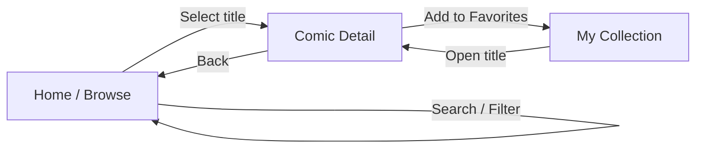
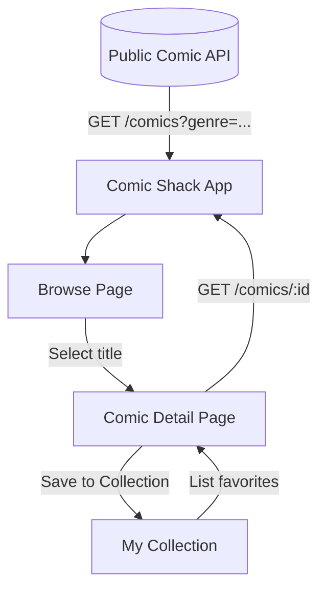
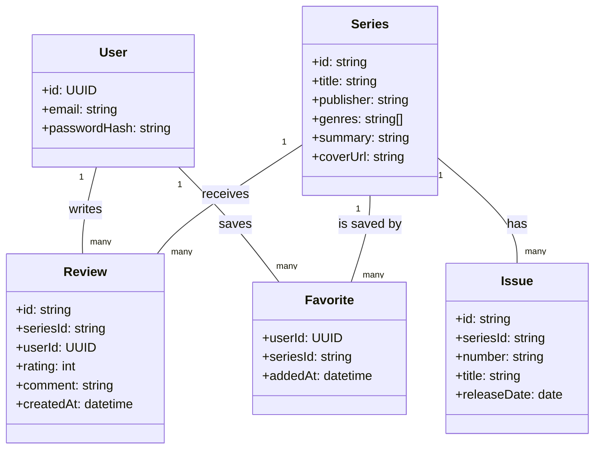
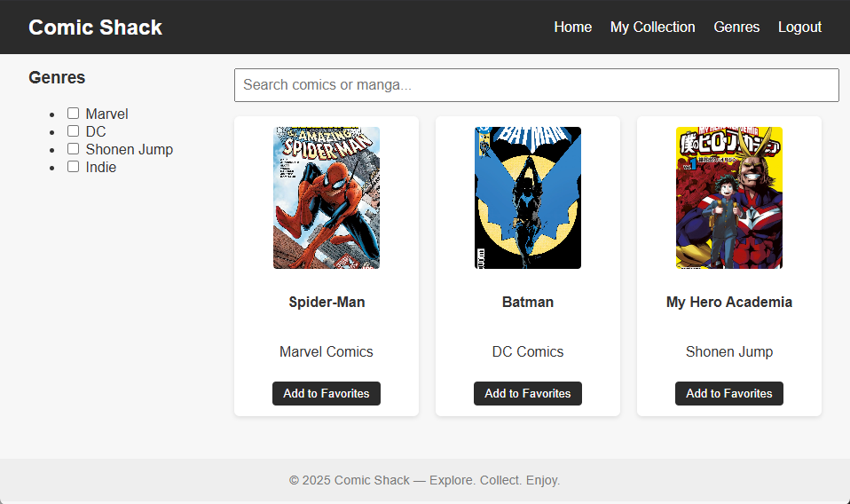
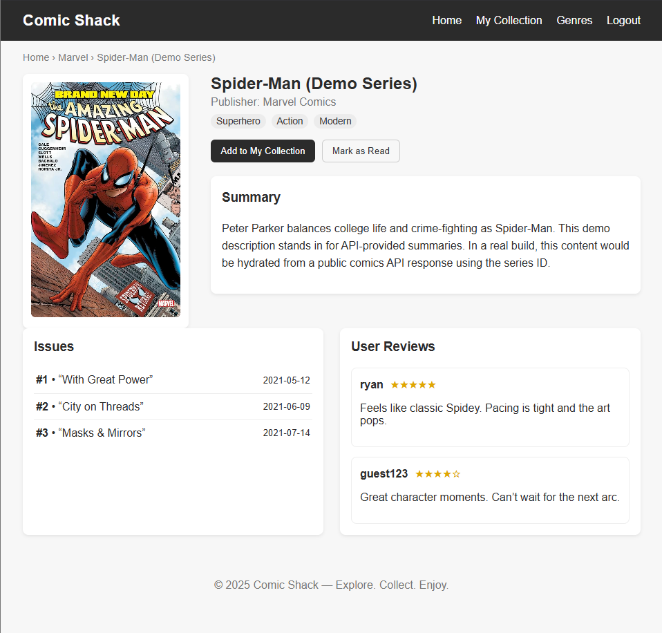

# 🎨 Comic Shack

Comic Shack is a web application designed to bring together fans of comics and manga into one easy-to-navigate platform. The goal of the project is to create a digital “comic shop” experience — a place where users can browse, discuss, and discover their favorite titles, from classic superhero stories to modern indie and manga series.

---

## 🧩 Project Overview

The project was inspired by the idea of combining the browsing experience of a comic store with the accessibility of a web app. Users will be able to:

- Browse comics and manga by genre or publisher
- Read summaries and issue details
- Save favorites or add them to a personal collection
- Post reviews or ratings for each series

This repository currently serves as the foundation for building and tracking the project. Development will focus first on front-end structure and API integration for comic data retrieval.

---

## 🧠 Objectives

- Learn version control using **Git** and **GitHub** for project tracking and collaboration
- Develop a structured, real-world web app with clean documentation
- Practice project organization and markdown formatting through a detailed README
- Use the repository as a portfolio example of software engineering practices

---

## 🗺️ User Flow Diagram

The following flowchart represents the **user journey** throughout the Comic Shack app — from browsing comics to viewing details and managing their collection.  
It shows how users interact with the app’s main pages and features.

## 🔁 Data Flow Diagram

This diagram illustrates how data moves through the system — from the public comic API to the user interface and local storage.
It emphasizes where user actions (searching, saving, and retrieving favorites) interact with backend data sources.

## 🧱 Data Model

This entity-relationship diagram shows the planned database and data structure for Comic Shack.
It helps ensure each page has the correct data available — from user details to comic series, issues, and reviews.

## 🖼️ Wireframes (UI)

> Note: Comic Shack is **not** a store—these screens cover browsing, details, and collection only.

### Browse Page

### Series Detail Page

